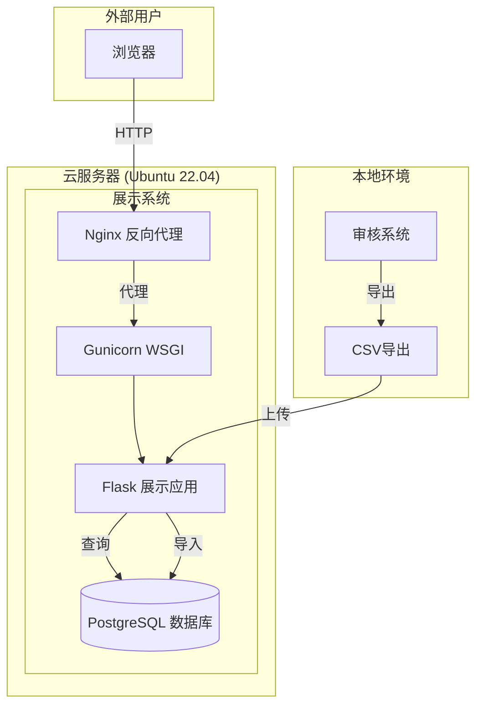

# Design Document

## Overview

审核结果展示系统是一个面向外部同事的只读Web应用，用于查看门店检查项的审核结果。系统采用Flask + PostgreSQL架构，部署在Ubuntu 22.04云服务器上，通过GitHub实现自动化部署。

### 项目组织

```
store-inspection-review/           # 现有项目根目录
├── app.py                         # 现有审核系统（本地运行）
├── viewer/                        # 新增：展示系统子目录
│   ├── app_viewer.py              # 展示系统Flask应用
│   ├── data_importer.py           # 数据导入模块
│   ├── templates/
│   │   └── viewer.html            # 展示系统前端页面
│   └── static/
│       ├── viewer.js              # 展示系统前端逻辑
│       └── viewer.css             # 展示系统样式
├── shared/                        # 新增：共用模块目录
│   ├── __init__.py
│   ├── database_models.py         # 共用数据库模型
│   └── whitelist_loader.py        # 共用白名单加载器
├── deploy/                        # 新增：部署脚本目录
│   ├── install.sh                 # 首次安装脚本
│   ├── update.sh                  # 更新脚本
│   ├── nginx.conf                 # Nginx配置
│   └── viewer.service             # Systemd服务配置
├── csv_exporter.py                # 修改：增加战区/省份/城市字段
└── ...                            # 其他现有文件
```

## Architecture



## Components and Interfaces

### 1. 展示系统Flask应用 (app_viewer.py)

**职责**：提供Web界面和API接口

**API接口**：

| 端点 | 方法 | 描述 |
|------|------|------|
| `/` | GET | 展示系统首页 |
| `/api/filters` | GET | 获取筛选选项（战区、省份、城市、门店标签列表） |
| `/api/filters/provinces` | GET | 根据战区获取省份列表 |
| `/api/filters/cities` | GET | 根据省份获取城市列表 |
| `/api/search` | GET | 根据筛选条件搜索审核结果 |
| `/admin/upload` | GET | 数据管理页面 |
| `/api/upload/whitelist` | POST | 上传白名单Excel |
| `/api/upload/reviews` | POST | 上传审核结果CSV |

### 2. 数据导入模块 (data_importer.py)

**职责**：解析上传的文件并导入数据库

**接口**：

```python
class DataImporter:
    def import_whitelist(self, file_path: str) -> ImportResult
    def import_reviews(self, file_path: str) -> ImportResult
    def validate_whitelist_format(self, df: DataFrame) -> bool
    def validate_reviews_format(self, df: DataFrame) -> bool
```

### 3. 共用数据库模型 (shared/database_models.py)

**职责**：定义数据库表结构，供两个系统共用

**模型**：
- `StoreWhitelist`：门店白名单（含战区、省份、城市、门店标签）
- `ReviewResult`：审核结果（展示系统专用表）

### 4. CSV导出增强 (csv_exporter.py)

**修改内容**：在导出时增加战区、省份、城市字段

## Data Models

### 门店白名单表 (store_whitelist)

| 字段 | 类型 | 说明 |
|------|------|------|
| store_id | VARCHAR(50) PK | 门店ID |
| store_name | VARCHAR(255) | 门店名称 |
| war_zone | VARCHAR(50) | 战区 |
| province | VARCHAR(50) | 省份 |
| city | VARCHAR(50) | 城市 |
| store_tag | VARCHAR(100) | 门店标签 |
| city_operator | VARCHAR(50) | 省市运营 |
| ... | ... | 其他字段 |

### 审核结果表 (viewer_review_results)

| 字段 | 类型 | 说明 |
|------|------|------|
| id | SERIAL PK | 自增主键 |
| store_name | VARCHAR(255) | 门店名称 |
| store_id | VARCHAR(50) | 门店编号 |
| war_zone | VARCHAR(50) | 战区 |
| province | VARCHAR(50) | 省份 |
| city | VARCHAR(50) | 城市 |
| area | VARCHAR(255) | 所属区域 |
| item_name | VARCHAR(255) | 检查项名称 |
| item_category | VARCHAR(100) | 检查项分类 |
| image_url | TEXT | 图片URL |
| review_result | VARCHAR(50) | 审核结果 |
| problem_note | TEXT | 问题描述 |
| review_time | DATETIME | 审核时间 |
| import_time | DATETIME | 导入时间 |

**索引**：
- `idx_war_zone`: war_zone
- `idx_province`: province  
- `idx_city`: city
- `idx_review_result`: review_result
- `idx_composite`: (war_zone, province, city, review_result)


## Correctness Properties

*A property is a characteristic or behavior that should hold true across all valid executions of a system-essentially, a formal statement about what the system should do. Properties serve as the bridge between human-readable specifications and machine-verifiable correctness guarantees.*

### Property 1: 级联筛选一致性
*For any* 战区选择，返回的省份列表中的每个省份都应属于该战区；*For any* 省份选择，返回的城市列表中的每个城市都应属于该省份。
**Validates: Requirements 1.2, 1.3**

### Property 2: 搜索结果筛选正确性
*For any* 筛选条件组合（战区、省份、城市、门店标签、是否合格），返回的每条审核结果都应满足所有指定的筛选条件。
**Validates: Requirements 1.4**

### Property 3: 搜索结果字段完整性
*For any* 搜索结果中的检查项，渲染后的内容应包含门店名称、检查项名称、图片URL、审核结果、问题描述（如果不合格）。
**Validates: Requirements 2.1**

### Property 4: 数据导入round-trip
*For any* 有效的白名单Excel或审核结果CSV数据，导入后从数据库查询应能获取到与原始数据一致的记录。
**Validates: Requirements 3.2, 3.3**

### Property 5: 导入记录数一致性
*For any* 成功导入的文件，返回的导入记录数应等于文件中的有效数据行数。
**Validates: Requirements 3.4**

### Property 6: 无效文件格式处理
*For any* 格式不正确的上传文件（缺少必需列、文件类型错误等），系统应返回错误响应而不是崩溃或导入错误数据。
**Validates: Requirements 3.5**

### Property 7: CSV导出字段完整性
*For any* 导出的审核结果CSV，每行数据应包含战区、省份、城市字段；当门店在白名单中存在时，这些字段应与白名单数据一致；当门店不存在时，这些字段应为空。
**Validates: Requirements 5.1, 5.2, 5.3**

## Error Handling

### 数据库连接错误
- 捕获数据库连接异常
- 返回友好的错误页面
- 记录详细错误日志

### 文件上传错误
- 验证文件类型（.xlsx, .csv）
- 验证文件大小限制（最大50MB）
- 验证必需列是否存在
- 返回具体的错误信息

### 数据查询错误
- 捕获SQL查询异常
- 返回空结果而不是错误页面
- 记录查询错误日志

## Testing Strategy

### 单元测试
使用 `pytest` 框架进行单元测试：
- 数据导入模块的解析逻辑
- 筛选条件的查询逻辑
- CSV导出的字段增强逻辑

### 属性测试
使用 `hypothesis` 库进行属性测试：
- 级联筛选一致性测试
- 搜索结果筛选正确性测试
- 数据导入round-trip测试
- CSV导出字段完整性测试

**属性测试配置**：
- 每个属性测试运行至少100次迭代
- 使用智能生成器生成测试数据

### 集成测试
- API端点的请求响应测试
- 文件上传流程测试
- 数据库操作测试

## Deployment Architecture

### 服务器配置
```
Ubuntu 22.04 LTS
├── Nginx (反向代理, 端口80/443)
├── Gunicorn (WSGI服务器, 端口8000)
├── PostgreSQL (数据库, 端口5432)
└── Systemd (服务管理)
```

### 部署脚本

**install.sh** - 首次安装脚本：
1. 更新系统包
2. 安装Python 3.10+、pip、venv
3. 安装PostgreSQL
4. 安装Nginx
5. 创建数据库和用户
6. 克隆代码仓库
7. 创建虚拟环境并安装依赖
8. 配置Nginx
9. 配置Systemd服务
10. 启动服务

**update.sh** - 更新脚本：
1. 拉取最新代码
2. 更新依赖
3. 执行数据库迁移（如有）
4. 重启服务

### Nginx配置
```nginx
server {
    listen 80;
    server_name your-domain.com;
    
    location / {
        proxy_pass http://127.0.0.1:8000;
        proxy_set_header Host $host;
        proxy_set_header X-Real-IP $remote_addr;
    }
    
    location /static {
        alias /path/to/viewer/static;
    }
}
```

### Systemd服务配置
```ini
[Unit]
Description=Review Result Viewer
After=network.target postgresql.service

[Service]
User=www-data
WorkingDirectory=/path/to/project/viewer
ExecStart=/path/to/venv/bin/gunicorn -w 4 -b 127.0.0.1:8000 app_viewer:app
Restart=always

[Install]
WantedBy=multi-user.target
```
