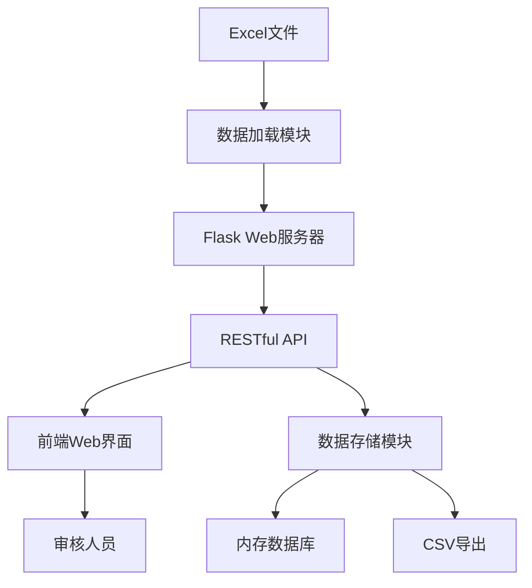

# 设计文档

## 概述

门店检查项图片审核系统是一个基于Python Flask的Web应用程序，运行在局域网环境中。系统采用前后端分离的架构，后端负责数据处理和API服务，前端提供交互式的审核界面。系统使用pandas读取Excel数据，通过RESTful API提供数据服务，前端使用原生JavaScript实现动态交互。

## 架构

### 系统架构图



### 技术栈

- **后端框架**: Flask (轻量级Python Web框架)
- **数据处理**: pandas (Excel读取和数据处理)
- **数据存储**: 内存字典结构 (快速读写)
- **前端**: HTML5 + CSS3 + 原生JavaScript
- **HTTP服务**: Flask内置开发服务器
- **数据格式**: JSON (API通信), CSV (导出)

### 部署架构

系统运行在局域网内的一台主机上，其他设备通过浏览器访问该主机的IP地址和端口。

## 组件和接口

### 后端组件

#### 1. 数据加载模块 (DataLoader)

**职责**: 读取和解析Excel文件

**接口**:
```python
class DataLoader:
    def load_excel(file_path: str) -> pd.DataFrame
    def validate_data(df: pd.DataFrame) -> bool
    def transform_data(df: pd.DataFrame) -> List[Dict]
```

#### 2. 白名单加载器 (WhitelistLoader)

**职责**: 读取白名单文件并关联运营人员信息

**接口**:
```python
class WhitelistLoader:
    def load_whitelist(file_path: str) -> pd.DataFrame
    def get_operator_mapping() -> Dict[str, str]  # {门店ID: 运营人员}
    def assign_operator(store_id: str) -> str  # 返回运营人员姓名
```

**逻辑**:
- 优先分配临时运营（如果存在且不为NaN）
- 否则分配省市运营
- 如果都不存在，返回"未分配"

#### 3. 审核数据管理器 (ReviewManager)

**职责**: 管理审核结果的存储和检索

**接口**:
```python
class ReviewManager:
    def save_review(item_id: str, result: str, timestamp: str) -> bool
    def get_review(item_id: str) -> Dict
    def get_all_reviews() -> List[Dict]
    def update_review(item_id: str, result: str, timestamp: str) -> bool
```

#### 4. CSV导出器 (CSVExporter)

**职责**: 生成CSV格式的审核报告

**接口**:
```python
class CSVExporter:
    def export_reviews(reviews: List[Dict], original_data: List[Dict]) -> str
    def generate_csv_content(data: List[Dict]) -> str
```

#### 5. Flask应用 (FlaskApp)

**职责**: 提供HTTP服务和RESTful API

**API端点**:
- `GET /` - 返回主页面HTML
- `GET /api/items` - 获取所有检查项数据（支持运营人员筛选）
- `GET /api/operators` - 获取所有运营人员列表
- `POST /api/review` - 提交审核结果
- `GET /api/reviews` - 获取所有审核结果
- `GET /api/export` - 导出CSV文件

### 前端组件

#### 1. 检查项卡片组件

**职责**: 展示单个检查项的信息和图片

**功能**:
- 显示门店信息（名称、编号、区域）
- 显示检查项名称
- 显示负责运营人员姓名
- 加载并显示标准图
- 提供审核按钮（✓/✗）
- 显示当前审核状态

#### 2. 运营人员筛选器

**职责**: 提供运营人员筛选功能

**功能**:
- 显示运营人员下拉选择框
- 列出所有运营人员（包括"全部"选项）
- 响应筛选条件变化
- 触发检查项列表更新

#### 3. 审核控制器

**职责**: 处理用户的审核操作

**功能**:
- 监听按钮点击事件
- 发送审核结果到后端API
- 更新UI状态
- 显示操作反馈

#### 4. 导出控制器

**职责**: 处理CSV导出功能

**功能**:
- 触发导出请求
- 处理文件下载
- 显示导出状态

## 数据模型

### 检查项数据模型

```python
{
    "id": "unique_identifier",  # 唯一标识符（门店编号_检查项名称）
    "检查项名称": "门店餐桌区",
    "门店名称": "牛约堡-手作牛肉汉堡(上海打浦桥)",
    "门店编号": "7",
    "所属区域": "牛约堡/上海战区/上海/上海",
    "标准图": "https://ossfile1.coolstore.cn/...",
    "检查项分类": "周清",
    "负责运营": "窦"  # 新增：从白名单关联的运营人员
}
```

### 白名单数据模型

```python
{
    "门店ID": 7,
    "省份": "上海",
    "城市": "上海",
    "门店名称": "莲园路店",
    "战区": "上海",
    "门店标签": "25年老店",
    "老运营": "吴",
    "省市运营": "窦",
    "临时运营": None,  # 可能为NaN/None
    "次运营": "袁",
    "门店营业状态": "营业中"
}
```

### 运营人员分配逻辑

```python
def get_operator(row):
    """
    获取门店负责运营人员
    优先级：临时运营 > 省市运营 > "未分配"
    """
    if pd.notna(row['临时运营']) and row['临时运营']:
        return row['临时运营']
    elif pd.notna(row['省市运营']) and row['省市运营']:
        return row['省市运营']
    else:
        return "未分配"
```

### 审核结果数据模型

```python
{
    "id": "unique_identifier",  # 唯一标识符（门店编号_检查项名称）
    "检查项名称": "门店餐桌区",
    "门店名称": "牛约堡-手作牛肉汉堡(上海打浦桥)",
    "门店编号": "7",
    "所属区域": "牛约堡/上海战区/上海/上海",
    "标准图": "https://ossfile1.coolstore.cn/...",
    "检查项分类": "周清"
}
```

### 审核结果数据模型

```python
{
    "item_id": "unique_identifier",
    "门店名称": "牛约堡-手作牛肉汉堡(上海打浦桥)",
    "门店编号": "7",
    "所属区域": "牛约堡/上海战区/上海/上海",
    "检查项名称": "门店餐桌区",
    "标准图": "https://ossfile1.coolstore.cn/...",
    "审核结果": "合格" | "不合格",
    "审核时间": "2026-01-09 15:30:45"
}
```

## 正确性属性

*属性是系统在所有有效执行中应该保持为真的特征或行为——本质上是关于系统应该做什么的形式化陈述。属性作为人类可读规范和机器可验证正确性保证之间的桥梁。*


### 属性反思

在编写具体属性之前，我们需要识别和消除冗余：

- 属性4.2和4.3（合格/不合格标记）可以合并为一个通用属性：提交任何审核结果都应正确保存
- 属性5.1和5.2有重叠：都在验证存储数据的完整性，可以合并
- 属性4.5和5.3都在测试数据持久化，可以合并到一个更全面的属性中
- 属性2.5和3.1都在测试数据可访问性，可以合并

### 属性 1: HTTP服务器端口绑定

*对于任何*有效的端口号，当系统启动时，应该能够在该端口上成功建立HTTP连接
**验证: 需求 1.1**

### 属性 2: 服务器信息输出完整性

*对于任何*成功启动的服务器实例，输出信息应该包含有效的IP地址格式和端口号
**验证: 需求 1.2**

### 属性 3: HTML页面响应

*对于任何*对根路径的HTTP GET请求，响应应该返回Content-Type为text/html且包含必要页面元素
**验证: 需求 1.3**

### 属性 4: 端口释放

*对于任何*启动后停止的服务器实例，应该能够在同一端口上立即重新启动服务器
**验证: 需求 1.4**

### 属性 5: Excel字段提取完整性

*对于任何*包含必需字段的Excel文件，读取后应该提取所有必需字段（检查项名称、门店名称、门店编号、所属区域、标准图URL）
**验证: 需求 2.2**

### 属性 6: 缺失字段检测

*对于任何*缺少必需字段的Excel文件，系统应该识别并报告具体缺失的字段名称
**验证: 需求 2.4**

### 属性 7: 数据加载后可访问性

*对于任何*成功加载的检查项数据，通过API应该能够检索到相同数量的检查项
**验证: 需求 2.5, 3.1**

### 属性 8: API响应数据完整性

*对于任何*检查项，API返回的JSON数据应该包含门店名称、门店编号、所属区域和检查项名称字段
**验证: 需求 3.2**

### 属性 9: URL到图片元素转换

*对于任何*包含图片URL的检查项，前端渲染应该将URL转换为HTML 标签
**验证: 需求 3.3**

### 属性 10: 数据排序一致性

*对于任何*检查项列表，API返回的数据应该按门店编号升序排列
**验证: 需求 3.5**

### 属性 11: 审核按钮存在性

*对于任何*渲染的检查项卡片，HTML应该包含合格和不合格两个按钮元素
**验证: 需求 4.1**

### 属性 12: 审核结果保存

*对于任何*检查项和任何审核结果（合格或不合格），提交后查询该检查项应该返回相同的审核结果
**验证: 需求 4.2, 4.3, 4.5**

### 属性 13: 审核结果更新

*对于任何*已有审核结果的检查项，提交新的审核结果后，查询应该返回最新的结果而不是旧结果
**验证: 需求 4.4**

### 属性 14: 审核数据完整性

*对于任何*提交的审核结果，存储的记录应该包含门店名称、门店编号、所属区域、检查项名称、标准图URL、审核结果和审核时间字段
**验证: 需求 5.1, 5.2, 5.3**

### 属性 15: 并发审核处理

*对于任何*一组针对不同检查项的并发审核请求，所有审核结果都应该被正确保存且不丢失
**验证: 需求 5.4**

### 属性 16: 审核结果幂等性

*对于任何*检查项，多次提交审核结果应该只保存一条记录，且为最新的审核结果
**验证: 需求 5.5**

### 属性 17: CSV导出数据完整性

*对于任何*一组审核结果，导出的CSV文件应该包含相同数量的数据行（不含表头）
**验证: 需求 6.1**

### 属性 18: CSV列完整性

*对于任何*导出的CSV文件，表头应该包含门店名称、门店编号、所属区域、检查项名称、标准图URL、审核结果和审核时间列
**验证: 需求 6.2**

### 属性 19: CSV下载响应头

*对于任何*导出请求，HTTP响应应该包含Content-Type为text/csv和Content-Disposition为attachment的响应头
**验证: 需求 6.3**

### 属性 20: CSV UTF-8编码

*对于任何*包含中文字符的审核结果，导出的CSV文件应该使用UTF-8编码，使中文字符能够正确显示
**验证: 需求 6.5**

## 错误处理

### 文件读取错误

- **场景**: Excel文件不存在或路径错误
- **处理**: 返回HTTP 500错误，包含具体的错误信息
- **用户反馈**: 在启动日志中显示错误信息和文件路径

### 数据验证错误

- **场景**: Excel文件缺少必需字段
- **处理**: 在启动时验证数据，列出所有缺失的字段
- **用户反馈**: 显示详细的验证错误信息

### 图片加载错误

- **场景**: 图片URL无效或无法访问
- **处理**: 前端显示占位符图片或错误图标
- **用户反馈**: 在图片位置显示"图片加载失败"提示

### API请求错误

- **场景**: 审核提交失败或网络错误
- **处理**: 返回适当的HTTP错误码（400/500）和错误信息
- **用户反馈**: 在前端显示错误提示，允许用户重试

### 并发冲突

- **场景**: 多个用户同时审核同一检查项
- **处理**: 使用最后写入胜出策略，保存最新的审核结果
- **用户反馈**: 无需特殊提示，系统自动处理

### 导出错误

- **场景**: 没有审核结果可导出
- **处理**: 返回HTTP 400错误和提示信息
- **用户反馈**: 显示"暂无审核结果可导出"提示

## 测试策略

### 单元测试

系统将使用pytest作为测试框架，对核心模块进行单元测试：

1. **DataLoader测试**
   - 测试Excel文件读取功能
   - 测试数据验证逻辑
   - 测试错误处理（文件不存在、格式错误）

2. **ReviewManager测试**
   - 测试审核结果的保存和检索
   - 测试更新现有审核结果
   - 测试数据结构的正确性

3. **CSVExporter测试**
   - 测试CSV生成功能
   - 测试UTF-8编码
   - 测试空数据处理

4. **API端点测试**
   - 测试各个API端点的响应
   - 测试错误状态码
   - 测试JSON数据格式

### 基于属性的测试

系统将使用Hypothesis库进行基于属性的测试，验证系统在各种输入下的正确性：

1. **配置要求**
   - 每个属性测试至少运行100次迭代
   - 使用随机生成的测试数据
   - 每个测试必须标注对应的设计文档属性编号

2. **测试标注格式**
   - 使用注释标注：`# Feature: store-inspection-review, Property X: [属性描述]`
   - 在测试函数文档字符串中引用需求编号

3. **测试覆盖**
   - 数据加载和验证属性（属性5, 6, 7）
   - API响应属性（属性8, 10）
   - 审核功能属性（属性12, 13, 14, 15, 16）
   - CSV导出属性（属性17, 18, 20）

### 集成测试

使用Flask测试客户端进行端到端测试：

1. **完整工作流测试**
   - 启动服务器 → 加载数据 → 获取检查项 → 提交审核 → 导出CSV
   - 验证整个流程的数据一致性

2. **并发测试**
   - 模拟多个客户端同时提交审核
   - 验证数据完整性和一致性

3. **前端集成测试**
   - 使用Selenium或Playwright测试前端交互
   - 验证UI元素的正确渲染和响应

## 性能考虑

### 数据加载

- Excel文件在启动时一次性加载到内存
- 对于大型文件（>1000行），考虑添加进度指示
- 预期加载时间：<5秒（1000行数据）

### 内存使用

- 审核结果存储在内存字典中
- 预期内存占用：约1MB每1000个审核结果
- 对于超大数据集，可考虑使用SQLite数据库

### 并发处理

- Flask开发服务器支持基本的并发请求
- 对于生产环境，建议使用Gunicorn或uWSGI
- 预期并发用户数：10-20个

### 图片加载

- 图片从外部URL加载，不占用服务器资源
- 前端实现懒加载，提升页面加载速度
- 图片加载失败不影响其他功能

## 安全考虑

### 局域网访问控制

- 系统仅在局域网内可访问
- 不暴露到公网，降低安全风险
- 可选：添加简单的密码认证

### 数据验证

- 验证所有API输入参数
- 防止SQL注入（虽然不使用数据库）
- 限制文件上传大小（如果添加上传功能）

### CORS配置

- 配置适当的CORS策略
- 仅允许局域网内的请求来源

## 部署说明

### 环境要求

- Python 3.8+
- pip包管理器
- 局域网连接

### 依赖包

```
flask==2.3.0
pandas==2.0.0
openpyxl==3.1.0
```

### 启动步骤

1. 安装依赖：`pip install -r requirements.txt`
2. 将Excel文件放置在项目根目录
3. 运行应用：`python app.py`
4. 访问显示的局域网地址

### 配置选项

- 端口号：可通过环境变量或配置文件设置
- Excel文件路径：可配置
- 日志级别：可配置（DEBUG/INFO/WARNING/ERROR）
